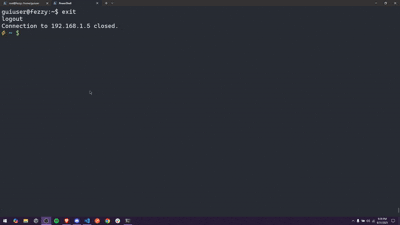

# 🖥️ Terminal File Navigator

A simple **terminal-based file navigator** written in **Node.js**, built from scratch as a personal project.  
It helps me manage files on my home servers more easily.

> ⚡ While there are many alternatives (like `ranger`, `nnn`, `mc`), this project was made for **learning purposes** and as a fun way to build my own tool.  
> It’s open-source — contributions are welcome!

---

## ✨ Features

- Navigate files & folders with arrow keys
- Open text files in `nano` directly
- Toggle hidden files/folders with **`h`**
- Different colors for files, folders, and hidden items
- Info bar showing file size or folder item count
- Inputs:
  - ↑ / ↓ → Move selection
  - **Enter** → Open file/folder
  - **Backspace** → Go up
  - **h** → Toggle hidden items
  - **q** → Quit

---

## 🚀 Setup Instructions

### 1. Clone the repository

```bash
git clone https://github.com/SohamGanmote/gui-terminal.git
cd terminal-file-navigator
```

### 2. Install Node.js (if not installed)

On Debian/Ubuntu:

```bash
sudo apt update
sudo apt install -y nodejs npm
```

### 3. Give execute permissions

```bash
chmod +x gui-bash/*.js
```

---

## 🔄 Auto-start on login

To start this navigator automatically when logging into your server, add it to your `~/.bash_profile` or `~/.bashrc`.

Edit the file:

```bash
nano ~/.bash_profile
```

Add this line at the end:

```bash
/home/<your-username>/terminal-file-navigator/index.js
```

Save and exit.
Now, every time you SSH/login to your server, the navigator will start automatically 🎉

---

## 📸 Demo

<p align="center">
  
</p>

## 🤝 Contributing

- Fork the repo
- Create a feature branch (`git checkout -b feature-new`)
- Commit changes (`git commit -m 'Added X feature'`)
- Push to branch (`git push origin feature-new`)
- Open a Pull Request 🚀

---


